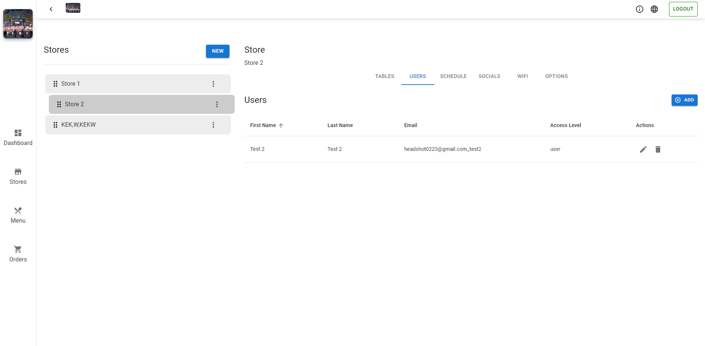

# QR Menu (**Client**) · In Progress...


This web application is designed for managing QR code menus for restaurants. It includes features such as user authentication, dashboard, store management, and menu creation.

## Table of Contents

-  [Folder Structure](#folder-structure)
-  [Usage](#usage)
-  [Screenshots](#screenshots)
-  [Localization](#localization)
-  [Contributing](#contributing)
-  [Dependencies](#dependencies)

## Folder Structure

-  **public:** Contains public assets and the main HTML file.
-  **src:**
   -  **components:** Reusable components.
   -  **redux:** Redux store setup and slices.
   -  **service:** Service functions for API communication.
   -  **App.js:** Main component rendering routes and managing state.
   -  **index.js:** Entry point of the application.
   -  **axios.js:** Configuration for Axios HTTP client.

## Usage

1. Clone the repository:

```bash
git clone https://github.com/HEAD0223/qr-menu-web.git
cd qr-menu-web
```

2. Install dependencies:

```bash
npm install
```

3. Start the development server:

```bash
yarn start
```

4. Visit `http://localhost:3000` in your browser to see the application.

## Screenshots





## Localization

The application supports localization using i18n. Translation files are located in the `public/assets/locales` directory. Add new translations as needed.

## Contributing

If you would like to contribute to this project, please follow these steps:

1. Fork the repository.
2. Create a new branch for your feature: `git checkout -b feature-name`
3. Commit your changes: `git commit -m 'Add some feature'`
4. Push to the branch: `git push origin feature-name`
5. Submit a pull request.

## Dependencies

-  **React:** JavaScript library for building user interfaces.
-  **Material-UI:** React UI framework for building responsive and accessible web applications.
-  **Redux Toolkit:** State management library for React applications.
-  **React Router:** Declarative routing for React.js.
-  **i18next:** Internationalization library for handling translations.
-  **axios:** Promise-based HTTP client for the browser and Node.js.
-  **js-cookie:** A simple, lightweight JavaScript API for handling cookies.
-  **react-toastify:** A library for displaying notifications in React applications.

Make sure to include these dependencies in your project.
